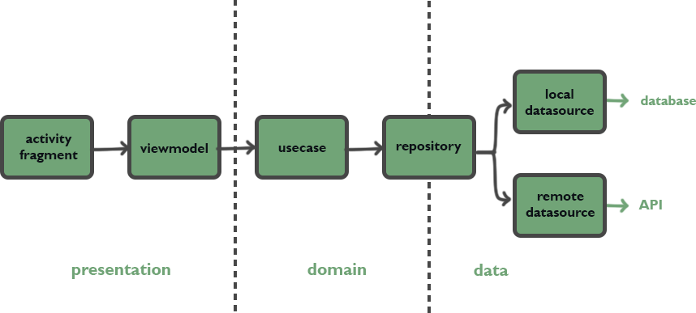

# MoviesApp

An Android app that allows you to access information about movies and select your favorites, fetching data from [The Movie DataBase (TMDb) API].

[The Movie DataBase (TMDb) API]: https://developers.themoviedb.org/3/

Project made during the Android development course ViC - Vitoria Code by Picpay.

## Implementation

- When opened, the app loads a list of the most popular movies
- Clicking on a movie loads details about that movie
- An error feedback is given if the API data load fails
- User can search for a specific movie through search mode or filter the movie list by selecting a genre
- Movies can be added to favorites and the user can access a list with their favorite movies

## Technical features

- [ViewBinding] is being used to reference layout views
- [Koin] for dependency injection
- [Navigation component] and [Safe Args] to handle navigating and passing data between fragments
- [ViewModel] being used so data survives configuration changes (like screen rotations)
- [LiveData] to encapsulate data that will be observed by the fragments
- [RxJava] used to handle streams of data (from the API and from the database to the viewmodel)
- [Retrofit] to make the API call and [Gson] to convert json data to java objects
- [Room] to save the user's favorite movies in a local database
- [Glide] for image loading from url

[ViewBinding]: https://developer.android.com/topic/libraries/view-binding
[Koin]: https://insert-koin.io/
[Navigation component]: https://developer.android.com/guide/navigation
[Safe Args]: https://developer.android.com/guide/navigation/navigation-pass-data#Safe-args
[ViewModel]: https://developer.android.com/topic/libraries/architecture/viewmodel
[LiveData]: https://developer.android.com/topic/libraries/architecture/livedata
[RxJava]: https://github.com/ReactiveX/RxJava
[Retrofit]: https://square.github.io/retrofit/
[Gson]: https://github.com/google/gson 
[Room]: https://developer.android.com/training/data-storage/room
[Glide]: https://github.com/bumptech/glide

### Clean architecture + MVVM

The application has been organized into the following layers:
- **presentation**: classes that concern the UI and presentation logic, the activity, fragments, adapters and viewmodel.
- **domain**: contains the business logic, usecases, data classes and the repository abstraction.
- **data**: interacts with data sources (database, api calls), contains repository implementation and also maps model objects to domain objects. 

